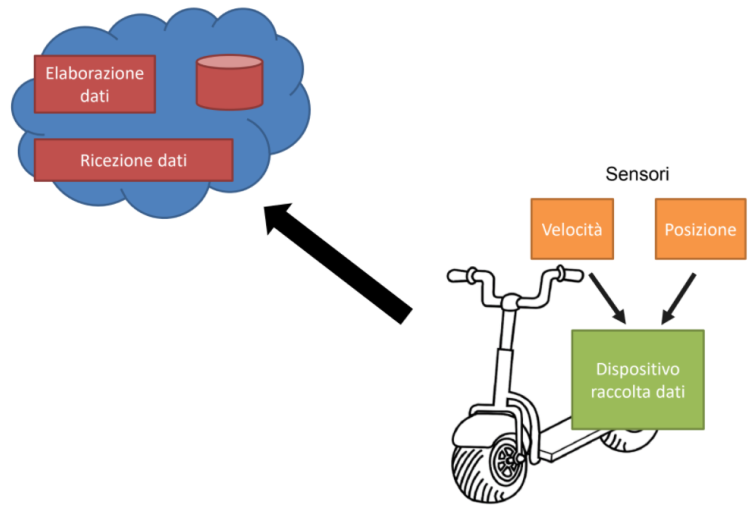

# Esercizio-Noleggio monopattino elettrico Maraspin e Apostu

Maraspin si è occupato della parte server del software, 
Apostu si è occupato della parte client del software

---
## Descrizione del progetto
In questa esercitazione bisogna, realizzare un servizio di noleggio e monitoraggio di monopattini elettrici. Il monopattino elettrico dispone di 4 sensori:
| Nome del sensore | Descrizione funzionamento |
| ---------------- | ------------------------- |
| SpeedSensor | misura la velocità del monopattino |
| BatterySensor | musare la percentuale di carica della batteria del monopattino |
| BrightnessSensor | imposta accensione e spegnimento luci del monopattino (in automatico) |
| GpsSensor | determina la posizione geografica del monopattino |

Questo software, simula il funzionamento di un monopattino e i suoi corrispettivi 4 sensori. Per eseguire questa simulazione abbiamo deciso di utilizzare un worker service che avrà la funzione di **client**, che manda i vari dati (tramite richieste Http oppure Mqtt) rilevati dai sensori e dal monopattino ogni T tempo. Il **server** invece riceve le varie richieste ricevute dal client e elabora i dati.

L'obiettivo di questa esercitazione è di prendere domestichezza con le tecnologie IoT, come ad esempio: 
- il protocollo di comunicazione da implementare (MQTT);
- la tencologia di comunicazione da implementare (BROKER - CLIENT);
- le tecniche di formattazione del messaggio da inviare;

---

## Protcol - Mqtt
Fase di studio e sviluppo per definire e realizzare al meglio i **topic** del *broker*.
1. **Topic monopattino elettrico**
  - *Es/scooter_id* -> comunicazione con il monopattino elettrico specificato tramite id
2. **Topic sensori del monopattino elettrico**
  - *Es/scooter_id/sensors* -> comunicazione con tutti i sensori del monopattino elettrico
  - *Es/scooter_id/sensors/speed* -> comunicazione con il sensore di velocità
  - *Es/scooter_id/sensors/battery* -> comunicazione con il sensore di carica della batteria
  - *Es/scooter_id/sensors/location* -> comunicazione con il sensore gps
  - *Es/scooter_id/sensors/light* -> comunicazione con il sensore di luce

---

## Protocol - Http
Api che inserisce dati all'interno del database e restituisce dati al client in base alle richieste ricevute
1. **GET**
  - *api/scooter* -> ritorna la lista di scooter
  - *api/scooter/1* -> ritorna lo scooter con l'id specificato
  - *api/sensor* -> ritorna la lista di sensori
  - *api/sensor/1* -> ritorna il sensore con l'id specificato
2. **POST**
  - *api/scooter* -> inserisce uno scooter all'interno del db
  - *api/sensor* -> inserisce un sensore all'interno del db
3. **PUT**
  - *api/scooter* -> aggiorno uno scooter all'interno del db
  - *api/sensor* -> aggiorno un sensore all'interno del db
4. **DELETE**
  - *api/scooter* -> elimino uno scooter all'interno del db
  - *api/sensor* -> elimino un sensore all'interno del db
